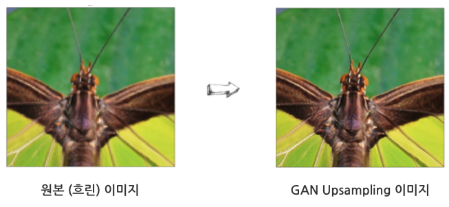
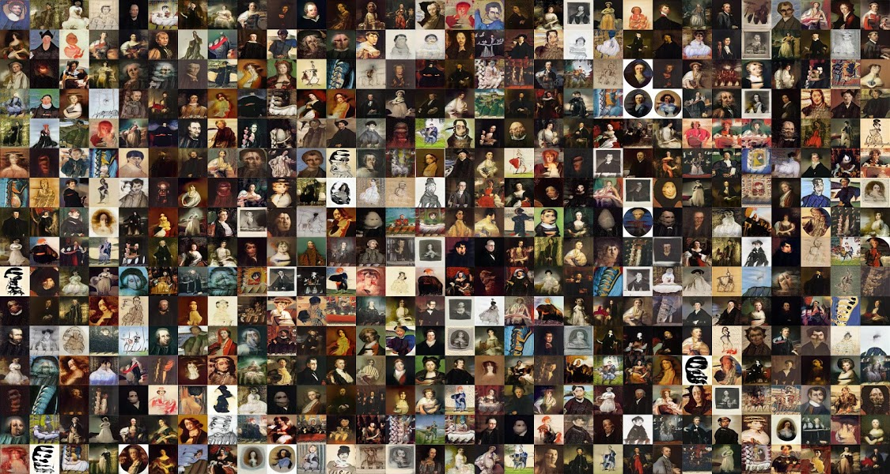
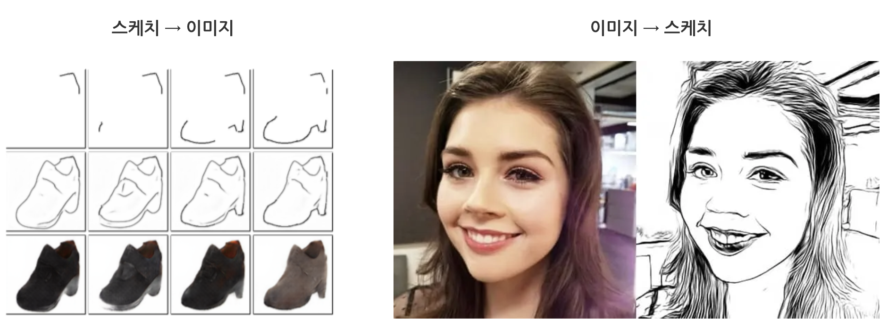

```{r setup, include=FALSE}
knitr::opts_chunk$set(echo = TRUE, message=FALSE, warning=FALSE,
                      comment="", digits = 3, tidy = FALSE, prompt = FALSE, fig.align = 'center')
```

# GAN 사용례 {#gan-use-cases}

- Reinforcement Learning: 자율주행 자동차 
    - 자율주행 자동차의 경우 보행자, 교통상황, 포트홀(Pothole), 날씨, 경사면 등 다양한 요소가 자율주행 자동차 인공지능 성능에 영향을 미치고 특히 사고가 나는 경우를 기존 지도 학습으로 할 경우 수십에서 수천번 실제 사고 데이터를 수집하는 것은 비경제적이다. 
- Semi-Supervised Leanring 
    - 딥러닝은 학습할 데이터가 많을 경우 성능이 좋다. 하지만 많은 학습 데이터는 고비용이며 시간이 많이 소요된다. 따라서 
라벨 데이터와 라벨이 없는 데이터를 결합시킨 Semi-Supervised Leanring 알고리즘 개발이 필요하다.
- Multi-Modal 분포 학습
    - 딥러닝 모형은 기본적으로 평균을 중심으로 학습되기 때문에 좀더 고성능의 알고리즘을 얻으려면 GAN을 사용하여 Multi-Modal 분포를 학습하여 적용시킬 경우 더 높은 성능을 얻을 수 있다.
- 선명한 이미지 [^upsampling]
    - 과거 사진이나 영화의 경우 해상도가 낮아 지금 기준으로 봤을 때 선명하지 않는 문제가 존재한다. 과거 좀더 또렷한 이미지를 얻으려고 **bicubic 보간법(interpolation)** 등을 사용했고 이러한 방법을 upsampling 으로 부른다.

[^upsampling]: [Martin Krasser, (2019-09-04), "Single image super-resolution with deep neural networks"](http://krasserm.github.io/2019/09/04/super-resolution/)

   

- 예술 작품
    - 과거 예술은 인간의 영역이라고 여겨졌으나 이제는 AI가 다양한 예술 작품을 창작하는 세상이 되었다. 이제는 AI가 그린 그림을 사고 팔 수 있으며 AI 작품을 모아 전시회를 갖기도 한다.
    
    

- Image-to-Image 변환 
    - 스케치 이미지를 색상과 사실감이 있는 이미지로 변환 혹은 반대로 사진으로 찍은 이미지를 스케치 이미지로 변환할 경우 다양한 활용사례를 만들어 낼 수 있다. 



- 자연어 (Natural Language)
    - 현재 상당부분 웹사이트 문서와 책 등 활자화된 것은 사람이 작성한 것이나 이를 기계가 학습하여 기계가 직접 저작하게 되면 낮은 비용과 속도로 인해 상당한 경쟁력을 갖추게 되는데 이를 TV 드라마, 영화, 잡지 등 저작물이 기계가 저작할 경우 특히, 사용자가 기계가 저작한 저작물에 탐닉하게 되면 피드백 효과가 나타나게 되고 이런 경우 예측가능한 미래가 펼쳐지게 된다.
    
    

